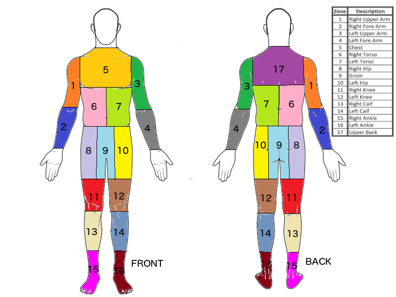
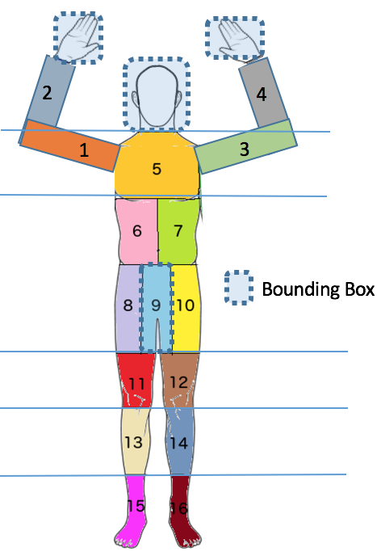

# Passenger Screening Model to Improve TSA's Threat Recognition in Airports.
## Capstone Proposal
Shivaraju Gowda  
December 17th, 2017

### Domain Background
Airport security is critical and necessary part of a safe travel. As anyone who has traveled on an airplane knows, this comes at the cost of long lines and wait times at the airport security checkpoint. The U.S. Transportation Security Administration (TSA) is responsible for all U.S. airport security, they screen more than two million passengers daily.

TSA is very aware of their conflicting goals of thorough security screenings and short wait times to keep their customers safe and happy at the same time. They have identified high false alarm rates with the current screening machines as creating significant bottlenecks at the airport checkpoints. When the sensors predict a potential threat, they need to engage in a secondary, time consuming manual screening process. With the increase in the number of travelers and new threats every year, the prediction models need to continually improve.

As of now, TSA purchases algorithms exclusively from the manufacturers of the scanning equipment. Like other enterprise software, these algorithms are proprietary, expensive, and have long release cycles. Because of the importance of an improved threat detection model to their bottom-line and the current success of Machine Learning in similar tasks, TSA has organized a Kaggle competition to see if the broader Machine Learning community can come up with a better model to detect threats during passenger screening. This competition has the [biggest dataset and the highest prize($1.5 Million) of all the Kaggle competitions hosted till now](https://www.kaggle.com/c/passenger-screening-algorithm-challenge/discussion/46037).

Kaggle Competition: [Website](https://www.kaggle.com/c/passenger-screening-algorithm-challenge)

With my new found confidence in Machine Learning after completing the Udacity NanoDegree coursework, I thought this project will be ideal to put my learning to use.

### Problem Statement
The main task of the competition is to use the output of the current sensors and develop algorithms/models to predict threats with increased accuracy. The model should also be nimble to adapt to new threats.

To train and evaluate the models/algorithms in this competition, sensor dataset for training and testing are provided for several subjects. The dataset is designed to capture real scanning conditions. They are comprised of volunteers wearing different clothing types (from light summer clothes to heavy winter clothes), different body mass indices, different genders, different numbers and types of threats.

The body zones are defined as in this image. There are 17 zones in total.

The threats come in different forms and shapes. They can be small handguns, knives, electronics, smuggled goods, etc. The model has to differentiate the threats from the clothing accessories.

The end goal is for the model to predict the probability of a threat present in each of the body zones  of a given subject. A subject can have multiple threats or no threats at all.

### Datasets and Inputs
The input dataset contains a large number of body scans of a number of subjects at different granularity levels acquired by a new generation of millimeter wave scanner. The scan for each subject  consists of the following four binary files:

- _.ahi = calibrated object raw data file (2.26GB per file)
- _.aps = projected image angle sequence file (10.3MB per file)
- _.a3d = combined image 3D file (330MB per file)
- _.a3daps = combined image angle sequence file (41.2MB per file)

Each of the above binary files for a subject corresponds to the same scan of the subject with different granularity levels. We could choose to either use the most detailed scan or the most coarse one to make our prediction. The trade-off is the time taken to process the images for training and inference, the most detailed format is 2.26 GB vs. 10.3 MB for the most coarse one. The aps format is the least detailed scan with 16 frames of images equally spaced radially.

This is a [2 stage competition](https://www.kaggle.com/two-stage-faq) with the following number of subjects in each stage.

- Stage 1
    - Training : 1147 subjects.
    - Testing : 100 subjects.
- Stage 2
    - Testing : 1388 subjects.

The data is sensitive because of the nature of the images. It is also quite large in size and could be found on the [Competition Website](https://www.kaggle.com/c/passenger-screening-algorithm-challenge/data).

### Solution Statement
To come up with a model for this project, I used these two pieces of information.

1) Recent success in object detection in an image using Machine Learning.
2) Relatively consistent human body ratios on the vertical axis.

The first will help us detect the location of a threat in an image. It will also be used to detect the location of head/hands and groin. The second will help in figuring out the body zone the threat belongs to using the relative position of the threat with respect to head, hands and groin. These two operations will be performed for each of the frames in a scan. The final logic will aggregate the predictions of all the frames to make a final prediction of the probability of threats in 17 body zones of the subject.

### Benchmark Model
As I discussed above in the Solution Statement, my model will have two steps for detecting the threats in body zones of a subject.

1. Detect Head, Hands, Groin and Threat bounding boxes using Object Detection API
2. Body Zone prediction of a threat using the bounding box of threat, Head, Hands and Groin obtained in the above step.

In order to accomplish 1, I will need a very accurate object detection model. The recent release of [TensorFlow Object Detection API](https://research.googleblog.com/2017/06/supercharge-your-computer-vision-models.html) shows an [accuracy of 80%](https://arxiv.org/abs/1611.10012), I plan to leverage it. Since there are 16 or more frames of a subject at different angles, I should be able to get more accuracy than this baseline.

There might be a large variation in human body parts ratios horizontally, but human body parts ratios vertically are reasonably consistent. [Professional artists usually depend on the size of the head to draw a proportional human figure](https://en.wikipedia.org/wiki/Body_proportions). I plan to leverage this information to detect the zones a threat bound box belongs to based on the location of Head, Hands and Groin and the frame number relative to the threat. I will need to experiment with the exact ratios, but because of the relative sizes of objects involved, I should be able to get a good prediction even with reasonable ratio estimates.  I also plan to experiment with training an XGBOOST based ML model to predict the zone in this step.

### Evaluation Metrics
Log loss is used as an evaluation metric for this competition. If there are N subjects in a test set, our model should make 17N predictions(17 body zones x N). Submissions are scored based on the formula:

\[
-\frac{1}{17N}\sum_{i=1}^{17N}[y_ilog(ŷ_i)+(1−y_i)log(1−ŷ_i)],
\]

where:

- N is the number of subjects in the test set
- $ŷ$ is our predicted probability of a subject having a threat in a given body zone.
- $y_i$ is the true label for a given subject and body zone. It is 1 if a threat is present, 0 otherwise
- $log()$ is the natural (base e) logarithm

The probabilities are truncated at $max(min(p,1−10^{−15}),10^{−15})$. A smaller log loss is better.

Because of the nature of the log loss evaluation metric, it is not just accuracy of our model that matters but also the ability to correctly predict the confidence we have in our prediction.
Predicting with high confidence a false prediction is penalized heavily.

### Project Design
#### Training Object Detection.
Here is the high-level flow of training object detection.

As discussed in the "Data Inputs" section, the input scan comes in different granularity levels. I visualized the scans at different levels and I found that in the aps format(the coarsest one) I could see most of the threats, only in approximately 1-2% of the cases I couldn't see the threats especially in the groin area. The computational needs of more detailed scans were way too much to handle my hardware budget. Furthermore, the increased time for analyzing such detailed scans would hinder more experimentation, so I made a decision to work with aps format only.

The TensorFlow Object Detection API takes in images in 3 channels(RGB). Our input is in grayscale. Even though converting the input to color is adding no more information, I decided to not experiment in this area and converted the grayscale array to jpg using matplotlib color map.

The TensorFlow Object Detection API is [well documented](https://github.com/tensorflow/models/tree/master/research/object_detection) and a [related paper](https://arxiv.org/abs/1611.10012) discusses the tradeoff of accuracy vs. speed for many of the models it supports. I plan to benchmark the following models for my use case and pick one.

- SSD MobileNet
- Faster RCNN
- Faster RCNN RESNET.

The image/object detection libraries usually detect well defined single objects, like a cat or a dog for example. In our case, the threat can come in different shapes and sizes. It is infeasible to come up with a list of all threats upfront. So it will be interesting to see if the models can capture different threats under one label. Initial experiments show this should be possible and I plan to use the same label for all threats.

My experiments showed my CPU only local desktop was 10x slower than a GPU for training the Object Detection API even after compiling TensorFlow with all the optimizations enabled. To use a GPU, I could either buy a new desktop or use Cloud infrastructure. The Google Cloud is well suited for TensorFlow Machine Learning workload. The Google Cloud Engine could also run this training on multiple GPUs. So even though it was a learning curve for me I choose to use a $300 Google Trial Credit and leverage the Google Cloud ML Engine for training in this stage.  

#### Training Zone Detection.
##### An Algorithm to Predict Body Zone.

Once the bounding boxes for head/hands/groin and threat are detected, the next task is to predict the zone the threat belongs to. As we can see in the image above, the vertical zone a threat belongs to can be deciphered to a reasonable degree using the following formulas with assumptions on only four ratios(ForeArm_ratio, Chest_ratio, Knee_ratio, Ankle_ratio).

- Upper Body = Groin_Start - Head_End
- Lower Body = Groin_Start - Image_End
- Upper Arm = Between Hands and Head_End
- Fore Arm = Between Head_End + Upper Body * ForeArm_ratio
- Chest = Head_End + Upper Body * Chest_ratio
- Torso: Between Chest and Groin.
- Hip: Groin.
- Knee: Groin_End + Lower Body * Knee_ratio.
- Calf: Knee + Lower Body * Ankle_ratio.
- Ankle: Between Calf and Image_End.

The ratios can be tweaked during the training stage to have a minimal error for all the training data.

Once the  vertical zone is detected, the side on which a threat is present can be deciphered using the centerline of head or groin and the frame number. Based on the vertical zone and the side we can come up with the exact body zone a threat bounding box belongs to.

The above approach might not be perfect and we might get into uncertainties in the vertical zones with 3 actual zones(like chest, upper back, hips) or in frames which show a side image. There are some heuristics which can be applied in such scenarios or at the minimum we can use the algorithm to feed training data to ML model discussed below.

##### XGBOOST model to predict zone.
The above approach might give us a good solution to the problem of zone detection, if it doesn't we could use its correct output as input to a supervised learning model using XGBOOST to predict the zones.

The input for the XGBOOST model will consist of the following

1) The Labeled input data in "Training Object Detection" where the actual threats are hand labeled as body zones and swapped out with one label as "threat" just before inputting to TFRecord.
2) Use the above custom algorithm to predict body zone for all the training data and use only the correctly predict zones as input.

#### Inference

The final inference model is shown in the above image. The inference will be done in batches. The final stage will aggregate the probabilities of all threats in all the frames and apply some heuristics to make a prediction on the probabilities of threats being present in each of the body zones of the test subjects.
